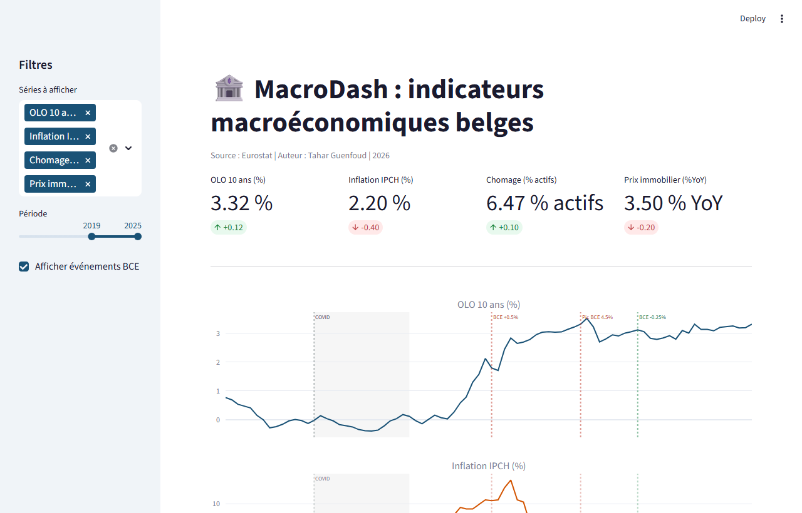

# MacroDash NBB

Dashboard macroéconomique interactif pour la Belgique, construit sur l'API Eurostat.

**Live :** [macrodashnbb.streamlit.app](https://macrodashnbb.streamlit.app/)

---

## Pourquoi ce projet

La Banque Nationale de Belgique (stat.nbb.be) a mis son API hors service en mars 2026. Ce projet construit un pipeline de remplacement complet à partir d'Eurostat, qui publie les mêmes séries macro belges via une API JSON gratuite et sans inscription.

L'objectif est double : montrer la transmission de la politique monétaire BCE sur l'économie belge réelle, et fournir un outil d'analyse directement pertinent pour un contexte bancaire.

---

## Aperçu



Les 4 KPIs en haut de page donnent la valeur la plus récente disponible pour chaque indicateur. Les graphiques en dessous permettent d'explorer la période souhaitée avec les événements BCE annotés.

---

## Narrative centrale : le cycle BCE 2022-2024

La BCE a relevé ses taux directeurs de 0 % à 4,5 % entre juillet 2022 et septembre 2023, puis a amorcé la baisse en juin 2024. Ce cycle est visible sur chacune des 6 séries du dashboard.

| Date | Événement |
|------|-----------|
| Juillet 2022 | Première hausse BCE (+0,5 %) |
| Septembre 2023 | Pic à 4,5 % |
| Juin 2024 | Première baisse (-0,25 %) |

Sur les données belges, la transmission est nette :
- OLO 10 ans : de -0,15 % en 2020 à +3,3 % en 2025
- Inflation IPCH : pic à 10,3 % en moyenne annuelle 2022, retour sous 3 % en 2025
- Prix immobiliers : +7 % YoY en 2021, refroidissement à +2 % YoY en 2023, reprise timide en 2024-2025

---

## Les 6 séries

| Clé | Code Eurostat | Description | Fréquence |
|-----|--------------|-------------|-----------|
| `olo_10y` | `irt_lt_mcby_m` | OLO belge 10 ans | Mensuelle |
| `euribor_3m` | `irt_h_mr3_m` | EURIBOR 3 mois | Mensuelle (2010-2014) |
| `inflation` | `prc_hicp_manr` | Inflation IPCH annuelle | Mensuelle |
| `chomage` | `une_rt_m` | Taux de chômage | Mensuelle |
| `pib` | `nama_10_gdp` | PIB Belgique en MEUR | Trimestrielle |
| `prix_immo` | `ei_hppi_q` | Indice des prix immobiliers | Trimestrielle |

Note : EURIBOR 3M n'est disponible sur Eurostat que jusqu'à fin 2014, quand les taux sont passés sous zéro. Pour la période 2022-2024, le cycle de taux courts est capturé indirectement via l'OLO 10 ans.

---

## Architecture

```
macrodash-nbb/
├── src/
│   ├── config.py           # Catalogue des séries, événements BCE, chemins
│   ├── fetch_eurostat.py   # Client API Eurostat (parsing JSON-stat)
│   ├── transform.py        # Alignement des fréquences mixtes vers mensuel
│   └── persist.py          # Stockage DuckDB (save / load / query / info)
├── app/
│   └── Home.py             # Application Streamlit
├── notebooks/
│   └── 01_exploration.ipynb  # Exploration, visualisations, corrélations
├── data/
│   ├── raw/                # Cache CSV des séries brutes (gitignore)
│   └── processed/          # DataFrame consolidé + DuckDB (gitignore)
├── docs/
│   └── JOUR1_DOCUMENTATION.md  # Documentation pédagogique détaillée
├── .streamlit/
│   └── config.toml         # Thème Streamlit
└── requirements.txt
```

### Flux de données

```
API Eurostat (JSON-stat)
    |
    v
EurostatClient.fetch_all()   -- parsing N-dimensionnel via strides
    |
    v
data/raw/*.csv               -- cache local par série
    |
    v
build_macro_df()             -- alignement mensuel, forward-fill trimestriel
    |
    v
persist.save()               -- stockage DuckDB (macro_monthly)
    |
    v
Streamlit Home.py            -- KPIs, subplots Plotly, matrice de corrélation
```

---

## Corrélations mesurées (Pearson, 2010-2025)

| Paire | r | Interprétation |
|-------|---|---------------|
| OLO 10Y x EURIBOR 3M | +0,73 | Taux longs et courts bougent ensemble avec la BCE |
| EURIBOR 3M x PIB | -0,83 | Hausse des taux = ralentissement économique |
| Chômage x PIB | -0,75 | Loi d'Okun : économie forte, emploi fort |
| OLO 10Y x Prix immobiliers | -0,30 | Taux hauts freinent la croissance des prix |

---

## Points techniques notables

### Parsing JSON-stat

L'API Eurostat retourne un tableau N-dimensionnel aplati. Le client reconstruit les indices multidimensionnels via la formule des strides :

```python
strides[i] = strides[i + 1] * sizes[i + 1]
dim_idx = (position // strides[i]) % sizes[i]
```

Voir `src/fetch_eurostat.py` pour le détail complet.

### Bugs API résolus (mai 2026)

Eurostat a modifié son API en 2026. Trois changements ont nécessité des corrections :

1. Le paramètre `lang=EN` génère une erreur HTTP 400 ("noEuroLegacy parameter is no longer supported"). Supprimé.
2. `endPeriod` est désormais obligatoire en même temps que `startPeriod`. Ajout d'un fallback sur l'année courante.
3. Les filtres de dimensions (`sex=T`, `age=TOTAL`, etc.) en query params génèrent des erreurs 400. Filtrés en pandas après récupération complète.

### Persistance DuckDB

Le module `src/persist.py` expose quatre fonctions :

```python
from src.persist import save, load, query, info

save(macro)          # persiste le DataFrame dans macro.duckdb
df = load()          # recharge avec DatetimeIndex
df = query("SELECT YEAR(date) AS annee, ROUND(AVG(inflation), 2) FROM macro_monthly GROUP BY annee")
info()               # résumé : lignes, période, NaN
```

---

## Installation

```bash
git clone https://github.com/Proftg/macrodash-nbb.git
cd macrodash-nbb
pip install -r requirements.txt
streamlit run app/Home.py
```

Le premier lancement appelle l'API Eurostat (environ 10 secondes) et met les données en cache local. Les lancements suivants utilisent le cache CSV dans `data/raw/`.

---

## Auteur

**Tahar Guenfoud** | Data Analyst en transition vers Data Scientist | Mons, Belgique

Master UMONS 2025 + Le Wagon Data Science & AI 2025

[GitHub](https://github.com/Proftg) | [Portfolio](https://proftg.github.io)
